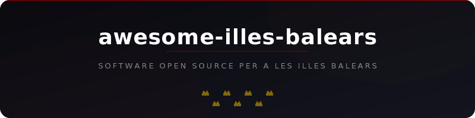

<div align="center">
  
  <br><br>
  <a href="https://awesome.re"></a>
  <br><br>
  <p>Una selección de software open source que da soporte específico a les Illes Balears, sus municipios, consells insulars e instituciones.</p>
  <p><a href="README-ca.md">Versión en catalán</a></p>
</div>

## Contenido

<!--lint disable awesome-list-item-->

- [Administración y Gobierno](#administración-y-gobierno)
- [Datos Abiertos](#datos-abiertos)
  - [Eivissa](#eivissa)
- [Emergencias y Seguridad](#emergencias-y-seguridad)
- [Energía y Sostenibilidad](#energía-y-sostenibilidad)
- [Interoperabilidad y Desarrollo](#interoperabilidad-y-desarrollo)
- [IoT y Telecomunicaciones](#iot-y-telecomunicaciones)
  - [Mallorca](#mallorca)
- [Medio Ambiente y Oceanografía](#medio-ambiente-y-oceanografía)
- [Salud Pública](#salud-pública)
- [Transporte y Movilidad](#transporte-y-movilidad)
  - [Mallorca](#mallorca-1)

<!--lint enable awesome-list-item-->

**Leyenda:** Cada entrada muestra:  estrellas,  actividad,  lenguaje,  licencia, [](https://www.caib.es/) etiqueta de institución/ubicación, ([Demo](https://github.com/GeiserX/awesome-illes-balears)) demo en vivo. Todas las insignias son clicables y se actualizan automáticamente. Las etiquetas enlazan a las páginas oficiales de cada institución.

## Administración y Gobierno

- [Carpeta Ciutadana](https://github.com/GovernIB/carpeta) [](https://github.com/GovernIB/carpeta/stargazers) [](https://github.com/GovernIB/carpeta/commits/master) [](https://github.com/GovernIB/carpeta) [](https://github.com/GovernIB/carpeta/blob/master/LICENSE) [](https://www.caib.es/) - Carpeta ciudadana digital del Govern de les Illes Balears.
- [Comanda](https://github.com/GovernIB/comanda) [](https://github.com/GovernIB/comanda/stargazers) [](https://github.com/GovernIB/comanda/commits/main) [](https://github.com/GovernIB/comanda) [](https://github.com/GovernIB/comanda/blob/main/LICENSE) [](https://www.caib.es/) - Cuadro de control para conocer el estado de una aplicación mediante llamadas REST.
- [ConCSV](https://github.com/GovernIB/concsv) [](https://github.com/GovernIB/concsv/stargazers) [](https://github.com/GovernIB/concsv/commits/main) [](https://github.com/GovernIB/concsv) [](https://github.com/GovernIB/concsv/blob/main/LICENSE) [](https://www.caib.es/) - Consulta de documentos por Código Seguro de Verificación del Govern de les Illes Balears.
- [DigitalIB](https://github.com/GovernIB/digitalib) [](https://github.com/GovernIB/digitalib/stargazers) [](https://github.com/GovernIB/digitalib/commits/master) [](https://github.com/GovernIB/digitalib) [](https://github.com/GovernIB/digitalib/blob/master/LICENSE) [](https://www.caib.es/) - Plataforma de digitalización y generación de copias auténticas de documentos de la CAIB.
- [Dir3CAIB](https://github.com/GovernIB/dir3caib) [](https://github.com/GovernIB/dir3caib/stargazers) [](https://github.com/GovernIB/dir3caib/commits/master) [](https://github.com/GovernIB/dir3caib) [](https://github.com/GovernIB/dir3caib/blob/master/LICENSE) [](https://www.caib.es/) - Servidor local del Directorio Común de Unidades Orgánicas (Dir3) para las aplicaciones de la CAIB.
- [EnviaFIB](https://github.com/GovernIB/enviafib) [](https://github.com/GovernIB/enviafib/stargazers) [](https://github.com/GovernIB/enviafib/commits/master) [](https://github.com/GovernIB/enviafib) [](https://github.com/GovernIB/enviafib/blob/master/LICENSE) [](https://www.caib.es/) - Servicio de envío de documentos a PortaFIB para firma digital.
- [GenApp](https://github.com/GovernIB/genapp) [](https://github.com/GovernIB/genapp/stargazers) [](https://github.com/GovernIB/genapp/commits/master) [](https://github.com/GovernIB/genapp) [](https://github.com/GovernIB/genapp/blob/master/LICENSE) [](https://www.caib.es/) - Generador de aplicaciones para el entorno de desarrollo del Govern de les Illes Balears.
- [Helium](https://github.com/GovernIB/helium) [](https://github.com/GovernIB/helium/stargazers) [](https://github.com/GovernIB/helium/commits/master) [](https://github.com/GovernIB/helium) [](https://github.com/GovernIB/helium/blob/master/LICENSE) [](https://www.caib.es/) - Gestor de expedientes administrativos del Govern de les Illes Balears.
- [InterDoc](https://github.com/GovernIB/interdoc) [](https://github.com/GovernIB/interdoc/stargazers) [](https://github.com/GovernIB/interdoc/commits/master) [](https://github.com/GovernIB/interdoc) [](https://github.com/GovernIB/interdoc/blob/master/LICENSE) [](https://www.caib.es/) - Sistema de intercambio de documentos por referencia entre aplicaciones de la CAIB.
- [PaymentIB](https://github.com/GovernIB/paymentib) [](https://github.com/GovernIB/paymentib/stargazers) [](https://github.com/GovernIB/paymentib/commits/master) [](https://github.com/GovernIB/paymentib) [](https://github.com/GovernIB/paymentib/blob/master/LICENSE) [](https://www.caib.es/) - Plataforma de pagos electrónicos del Govern de les Illes Balears.
- [PINBAL](https://github.com/GovernIB/pinbal) [](https://github.com/GovernIB/pinbal/stargazers) [](https://github.com/GovernIB/pinbal/commits/master) [](https://github.com/GovernIB/pinbal) [](https://github.com/GovernIB/pinbal/blob/master/LICENSE) [](https://www.caib.es/) - Plataforma de Interoperabilidad de les Illes Balears.
- [PluginsIB Login](https://github.com/GovernIB/pluginsib-login) [](https://github.com/GovernIB/pluginsib-login/stargazers) [](https://github.com/GovernIB/pluginsib-login/commits/main) [](https://github.com/GovernIB/pluginsib-login) [](https://github.com/GovernIB/pluginsib-login/blob/main/LICENSE) [](https://www.caib.es/) - Plugins de autenticación (LoginIB, Mock, etc.) para aplicaciones de la CAIB.
- [PluginsIB Signature Server](https://github.com/GovernIB/pluginsib-signatureserver) [](https://github.com/GovernIB/pluginsib-signatureserver/stargazers) [](https://github.com/GovernIB/pluginsib-signatureserver/commits/main) [](https://github.com/GovernIB/pluginsib-signatureserver) [](https://github.com/GovernIB/pluginsib-signatureserver/blob/main/LICENSE) [](https://www.caib.es/) - Plugins de firma electrónica en servidor para aplicaciones de la CAIB.
- [PluginsIB Signature Web](https://github.com/GovernIB/pluginsib-signatureweb) [](https://github.com/GovernIB/pluginsib-signatureweb/stargazers) [](https://github.com/GovernIB/pluginsib-signatureweb/commits/main) [](https://github.com/GovernIB/pluginsib-signatureweb) [](https://github.com/GovernIB/pluginsib-signatureweb/blob/main/LICENSE) [](https://www.caib.es/) - Plugins de firma electrónica web para aplicaciones de la CAIB.
- [PortaFIB](https://github.com/GovernIB/portafib) [](https://github.com/GovernIB/portafib/stargazers) [](https://github.com/GovernIB/portafib/commits/master) [](https://github.com/GovernIB/portafib) [](https://github.com/GovernIB/portafib/blob/master/LICENSE) [](https://www.caib.es/) - Portafirmas digital del Govern de les Illes Balears.
- [Registre](https://github.com/GovernIB/registre) [](https://github.com/GovernIB/registre/stargazers) [](https://github.com/GovernIB/registre/commits/master) [](https://github.com/GovernIB/registre) [](https://github.com/GovernIB/registre/blob/master/LICENSE) [](https://www.caib.es/) - Aplicación web de registro de anotaciones de entrada y salida.
- [RFHAB](https://github.com/GovernIB/rfhab) [](https://github.com/GovernIB/rfhab/stargazers) [](https://github.com/GovernIB/rfhab/commits/main) [](https://github.com/GovernIB/rfhab) [](https://github.com/GovernIB/rfhab/blob/main/LICENSE) [](https://www.caib.es/) - Registro de Funcionarios Habilitados del Govern de les Illes Balears.
- [RolSac](https://github.com/GovernIB/rolsac) [](https://github.com/GovernIB/rolsac/stargazers) [](https://github.com/GovernIB/rolsac/commits/master) [](https://github.com/GovernIB/rolsac) [](https://github.com/GovernIB/rolsac/blob/master/LICENSE) [](https://www.caib.es/) - Gestor de contenidos administrativos del Govern de les Illes Balears.
- [SISTRA](https://github.com/GovernIB/sistra) [](https://github.com/GovernIB/sistra/stargazers) [](https://github.com/GovernIB/sistra/commits/master) [](https://github.com/GovernIB/sistra) [](https://github.com/GovernIB/sistra/blob/master/LICENSE) [](https://www.caib.es/) - Sistema de Tramitación Administrativa de les Illes Balears.

## Datos Abiertos

### Eivissa

- [ckanext-ibizacouncil](https://github.com/ConselldEivissa/ckanext-ibizacouncil) [](https://github.com/ConselldEivissa/ckanext-ibizacouncil/stargazers) [](https://github.com/ConselldEivissa/ckanext-ibizacouncil/commits/master) [](https://github.com/ConselldEivissa/ckanext-ibizacouncil) [](https://github.com/ConselldEivissa/ckanext-ibizacouncil/blob/master/LICENSE) [](https://www.conselldeivissa.es/) - Extensión CKAN para la personalización del portal de datos abiertos del Consell Insular d'Eivissa.

## Emergencias y Seguridad

- [112go](https://github.com/bitifet/112go) [](https://github.com/bitifet/112go/stargazers) [](https://github.com/bitifet/112go/commits/master) [](https://github.com/bitifet/112go) [](https://github.com/bitifet/112go/blob/master/LICENSE) [](https://www.caib.es/) - Notificación automática al servicio 112 de les Illes Balears si no regresas de una excursión de senderismo.

## Energía y Sostenibilidad

- [Puntos de Recarga Baleares](https://github.com/ireneff23/puntos-recarga) [](https://github.com/ireneff23/puntos-recarga/stargazers) [](https://github.com/ireneff23/puntos-recarga/commits/main) [](https://github.com/ireneff23/puntos-recarga) [](https://github.com/ireneff23/puntos-recarga/blob/main/LICENSE) [](https://www.caib.es/) - Mapa de puntos de recarga de vehículos eléctricos en les Illes Balears.
- [Regata Solar Balears](https://github.com/Makespace-Mallorca/regatasolarbalears.github.io) [](https://github.com/Makespace-Mallorca/regatasolarbalears.github.io/stargazers) [](https://github.com/Makespace-Mallorca/regatasolarbalears.github.io/commits/main) [](https://github.com/Makespace-Mallorca/regatasolarbalears.github.io) [](https://github.com/Makespace-Mallorca/regatasolarbalears.github.io/blob/main/LICENSE) [](https://regatasolarbalears.github.io/) - Web oficial de la Regata de barcos solares de les Illes Balears.

## Interoperabilidad y Desarrollo

- [EmiservBackoffice](https://github.com/Fundacio-Bit/emiservbackoffice) [](https://github.com/Fundacio-Bit/emiservbackoffice/stargazers) [](https://github.com/Fundacio-Bit/emiservbackoffice/commits/main) [](https://github.com/Fundacio-Bit/emiservbackoffice) [](https://github.com/Fundacio-Bit/emiservbackoffice/blob/main/LICENSE) [](https://www.fundaciobit.org/) - Plantilla de aplicación backoffice para el emisor EMISERV de interoperabilidad de la CAIB.
- [PINBALAdmin](https://github.com/Fundacio-Bit/pinbaladmin) [](https://github.com/Fundacio-Bit/pinbaladmin/stargazers) [](https://github.com/Fundacio-Bit/pinbaladmin/commits/main) [](https://github.com/Fundacio-Bit/pinbaladmin) [](https://github.com/Fundacio-Bit/pinbaladmin/blob/main/LICENSE) [](https://www.fundaciobit.org/) - Gestor de solicitudes de permisos de acceso a la plataforma PINBAL de les Illes Balears.
- [PINBALMonitor](https://github.com/Fundacio-Bit/pinbalmonitor) [](https://github.com/Fundacio-Bit/pinbalmonitor/stargazers) [](https://github.com/Fundacio-Bit/pinbalmonitor/commits/main) [](https://github.com/Fundacio-Bit/pinbalmonitor) [](https://github.com/Fundacio-Bit/pinbalmonitor/blob/main/LICENSE) [](https://www.fundaciobit.org/) - Herramienta de monitorización de los emisores SCSP de la plataforma PINBAL.
- [VersioApp](https://github.com/Fundacio-Bit/versioapp) [](https://github.com/Fundacio-Bit/versioapp/stargazers) [](https://github.com/Fundacio-Bit/versioapp/commits/main) [](https://github.com/Fundacio-Bit/versioapp) [](https://github.com/Fundacio-Bit/versioapp/blob/main/LICENSE) [](https://www.fundaciobit.org/) - Gestión de versiones de aplicaciones en los distintos entornos de la CAIB.

## IoT y Telecomunicaciones

### Mallorca

- [LoRa Gateway Mallorca](https://github.com/McOrts/LoRa_gateway) [](https://github.com/McOrts/LoRa_gateway/stargazers) [](https://github.com/McOrts/LoRa_gateway/commits/master) [](https://github.com/McOrts/LoRa_gateway) [](https://github.com/McOrts/LoRa_gateway/blob/master/LICENSE) [](https://www.thethingsnetwork.org/) - Manuales e instrucciones para el desarrollo de la red LoRa TTN en Mallorca para comunicaciones IoT gratuitas.

## Medio Ambiente y Oceanografía

- [API Examples SOCIB](https://github.com/socib/API_examples) [](https://github.com/socib/API_examples/stargazers) [](https://github.com/socib/API_examples/commits/master) [](https://github.com/socib/API_examples) [](https://github.com/socib/API_examples/blob/master/LICENSE) [](https://www.socib.es/) - Notebooks Python para descubrir y procesar datos oceanográficos de les Illes Balears vía la API de SOCIB.
- [Espacios Naturales Protegidos Baleares](https://github.com/mmc244/Espacios_Naturales_Protegidos-Islas_Baleares) [](https://github.com/mmc244/Espacios_Naturales_Protegidos-Islas_Baleares/stargazers) [](https://github.com/mmc244/Espacios_Naturales_Protegidos-Islas_Baleares/commits/main) [](https://github.com/mmc244/Espacios_Naturales_Protegidos-Islas_Baleares) [](https://github.com/mmc244/Espacios_Naturales_Protegidos-Islas_Baleares/blob/main/LICENSE) [](https://www.caib.es/) - Visualización geográfica de los Espacios Naturales Protegidos en les Illes Balears.
- [FloraIberica](https://github.com/Pakillo/FloraIberica) [](https://github.com/Pakillo/FloraIberica/stargazers) [](https://github.com/Pakillo/FloraIberica/commits/master) [](https://github.com/Pakillo/FloraIberica) [](https://github.com/Pakillo/FloraIberica/blob/master/LICENSE) [](https://www.caib.es/) - Paquete R para obtener datos taxonómicos y de distribución de las aproximadamente 6500 plantas vasculares de la Península Ibérica e Illes Balears.
- [Glider Toolbox](https://github.com/socib/glider_toolbox) [](https://github.com/socib/glider_toolbox/stargazers) [](https://github.com/socib/glider_toolbox/commits/master) [](https://github.com/socib/glider_toolbox) [](https://github.com/socib/glider_toolbox/blob/master/LICENSE) [](https://www.socib.es/) - Scripts MATLAB/Octave para gestionar datos de la flota de gliders oceanográficos de SOCIB en les Illes Balears.
- [Grumers](https://github.com/socib/grumers) [](https://github.com/socib/grumers/stargazers) [](https://github.com/socib/grumers/commits/master) [](https://github.com/socib/grumers) [](https://github.com/socib/grumers/blob/master/LICENSE) [](https://www.socib.es/) - Aplicación web Django para recopilar datos de avistamientos de medusas en les Illes Balears.
- [HF Radar Reports](https://github.com/socib/HFRadarReports) [](https://github.com/socib/HFRadarReports/stargazers) [](https://github.com/socib/HFRadarReports/commits/master) [](https://github.com/socib/HFRadarReports) [](https://github.com/socib/HFRadarReports/blob/master/LICENSE) [](https://www.socib.es/) - Herramienta Python para generar informes mensuales del radar de alta frecuencia gestionado por SOCIB.
- [NetCDF Extended Utils](https://github.com/socib/netcdf_extended_utils) [](https://github.com/socib/netcdf_extended_utils/stargazers) [](https://github.com/socib/netcdf_extended_utils/commits/master) [](https://github.com/socib/netcdf_extended_utils) [](https://github.com/socib/netcdf_extended_utils/blob/master/LICENSE) [](https://www.socib.es/) - Utilidades extendidas para modificar ficheros NetCDF de datos oceanográficos de SOCIB.
- [Parcs Naturals Balears](https://github.com/spaghetticoder77/ParcsNaturalsBalears) [](https://github.com/spaghetticoder77/ParcsNaturalsBalears/stargazers) [](https://github.com/spaghetticoder77/ParcsNaturalsBalears/commits/main) [](https://github.com/spaghetticoder77/ParcsNaturalsBalears) [](https://github.com/spaghetticoder77/ParcsNaturalsBalears/blob/main/LICENSE) [](https://www.caib.es/) - Story Map interactivo de los Parques Naturales de les Illes Balears.
- [Seaboard SOCIB](https://github.com/socib/seaboard) [](https://github.com/socib/seaboard/stargazers) [](https://github.com/socib/seaboard/commits/master) [](https://github.com/socib/seaboard) [](https://github.com/socib/seaboard/blob/master/LICENSE) [](https://www.socib.es/) - Paneles de visualización en tiempo real de datos oceánicos costeros de SOCIB para el sector turístico de les Illes Balears.

## Salud Pública

- [CovidIB](https://github.com/Fundacio-Bit/covidib) [](https://github.com/Fundacio-Bit/covidib/stargazers) [](https://github.com/Fundacio-Bit/covidib/commits/master) [](https://github.com/Fundacio-Bit/covidib) [](https://github.com/Fundacio-Bit/covidib/blob/master/LICENSE) [](https://www.fundaciobit.org/) - Estadísticas y datos de COVID-19 para les Illes Balears.

## Transporte y Movilidad

### Mallorca

- [mallorca_transit_services](https://github.com/open-transport-mallorca/mallorca_transit_services) [](https://github.com/open-transport-mallorca/mallorca_transit_services/stargazers) [](https://github.com/open-transport-mallorca/mallorca_transit_services/commits/main) [](https://github.com/open-transport-mallorca/mallorca_transit_services) [](https://github.com/open-transport-mallorca/mallorca_transit_services/blob/main/LICENSE) [](https://www.tib.org/) - API pública para acceder a los servicios de transporte de Mallorca.
- [ViaMallorca](https://github.com/open-transport-mallorca/ViaMallorca) [](https://github.com/open-transport-mallorca/ViaMallorca/stargazers) [](https://github.com/open-transport-mallorca/ViaMallorca/commits/main) [](https://github.com/open-transport-mallorca/ViaMallorca) [](https://github.com/open-transport-mallorca/ViaMallorca/blob/main/LICENSE) [](https://www.tib.org/) - Aplicación para seguir autobuses en toda Mallorca con horarios, rutas e información en tiempo real.

## Insignia

Si tu proyecto aparece en esta lista, puedes añadir una de estas insignias a tu README para que la gente lo sepa.

<!--lint disable double-link-->

![listed on awesome-illes-balears](https://img.shields.io/badge/listed%20on-awesome--illes--balears-FFD700?style=flat&logo=data:image/svg%2bxml;base64,PHN2ZyB4bWxucz0iaHR0cDovL3d3dy53My5vcmcvMjAwMC9zdmciIHZpZXdCb3g9IjAgMCAxNCAxNCI+PGcgZmlsbD0iI0ZGRDcwMCI+PHJlY3QgeD0iMCIgeT0iMiIgd2lkdGg9IjIiIGhlaWdodD0iMiIvPjxyZWN0IHg9IjIiIHk9IjAiIHdpZHRoPSIyIiBoZWlnaHQ9IjIiLz48cmVjdCB4PSI0IiB5PSIyIiB3aWR0aD0iMiIgaGVpZ2h0PSIyIi8+PHJlY3QgeD0iNiIgeT0iMCIgd2lkdGg9IjIiIGhlaWdodD0iMiIvPjxyZWN0IHg9IjgiIHk9IjIiIHdpZHRoPSIyIiBoZWlnaHQ9IjIiLz48cmVjdCB4PSIxMCIgeT0iMCIgd2lkdGg9IjIiIGhlaWdodD0iMiIvPjxyZWN0IHg9IjEyIiB5PSIyIiB3aWR0aD0iMiIgaGVpZ2h0PSIyIi8+PHJlY3QgeD0iMCIgeT0iNyIgd2lkdGg9IjIiIGhlaWdodD0iMiIvPjxyZWN0IHg9IjIiIHk9IjUiIHdpZHRoPSIyIiBoZWlnaHQ9IjIiLz48cmVjdCB4PSI0IiB5PSI3IiB3aWR0aD0iMiIgaGVpZ2h0PSIyIi8+PHJlY3QgeD0iNiIgeT0iNSIgd2lkdGg9IjIiIGhlaWdodD0iMiIvPjxyZWN0IHg9IjgiIHk9IjciIHdpZHRoPSIyIiBoZWlnaHQ9IjIiLz48cmVjdCB4PSIxMCIgeT0iNSIgd2lkdGg9IjIiIGhlaWdodD0iMiIvPjxyZWN0IHg9IjEyIiB5PSI3IiB3aWR0aD0iMiIgaGVpZ2h0PSIyIi8+PHJlY3QgeD0iMCIgeT0iMTIiIHdpZHRoPSIxNCIgaGVpZ2h0PSIyIi8+PC9nPjwvc3ZnPg==&labelColor=8B0000) ![listed on awesome-illes-balears](https://img.shields.io/badge/listed%20on-awesome--illes--balears-FFD700?style=flat-square&logo=data:image/svg%2bxml;base64,PHN2ZyB4bWxucz0iaHR0cDovL3d3dy53My5vcmcvMjAwMC9zdmciIHZpZXdCb3g9IjAgMCAxNCAxNCI+PGcgZmlsbD0iI0ZGRDcwMCI+PHJlY3QgeD0iMCIgeT0iMiIgd2lkdGg9IjIiIGhlaWdodD0iMiIvPjxyZWN0IHg9IjIiIHk9IjAiIHdpZHRoPSIyIiBoZWlnaHQ9IjIiLz48cmVjdCB4PSI0IiB5PSIyIiB3aWR0aD0iMiIgaGVpZ2h0PSIyIi8+PHJlY3QgeD0iNiIgeT0iMCIgd2lkdGg9IjIiIGhlaWdodD0iMiIvPjxyZWN0IHg9IjgiIHk9IjIiIHdpZHRoPSIyIiBoZWlnaHQ9IjIiLz48cmVjdCB4PSIxMCIgeT0iMCIgd2lkdGg9IjIiIGhlaWdodD0iMiIvPjxyZWN0IHg9IjEyIiB5PSIyIiB3aWR0aD0iMiIgaGVpZ2h0PSIyIi8+PHJlY3QgeD0iMCIgeT0iNyIgd2lkdGg9IjIiIGhlaWdodD0iMiIvPjxyZWN0IHg9IjIiIHk9IjUiIHdpZHRoPSIyIiBoZWlnaHQ9IjIiLz48cmVjdCB4PSI0IiB5PSI3IiB3aWR0aD0iMiIgaGVpZ2h0PSIyIi8+PHJlY3QgeD0iNiIgeT0iNSIgd2lkdGg9IjIiIGhlaWdodD0iMiIvPjxyZWN0IHg9IjgiIHk9IjciIHdpZHRoPSIyIiBoZWlnaHQ9IjIiLz48cmVjdCB4PSIxMCIgeT0iNSIgd2lkdGg9IjIiIGhlaWdodD0iMiIvPjxyZWN0IHg9IjEyIiB5PSI3IiB3aWR0aD0iMiIgaGVpZ2h0PSIyIi8+PHJlY3QgeD0iMCIgeT0iMTIiIHdpZHRoPSIxNCIgaGVpZ2h0PSIyIi8+PC9nPjwvc3ZnPg==&labelColor=8B0000) ![listed on awesome-illes-balears](https://img.shields.io/badge/listed%20on-awesome--illes--balears-FFD700?style=plastic&logo=data:image/svg%2bxml;base64,PHN2ZyB4bWxucz0iaHR0cDovL3d3dy53My5vcmcvMjAwMC9zdmciIHZpZXdCb3g9IjAgMCAxNCAxNCI+PGcgZmlsbD0iI0ZGRDcwMCI+PHJlY3QgeD0iMCIgeT0iMiIgd2lkdGg9IjIiIGhlaWdodD0iMiIvPjxyZWN0IHg9IjIiIHk9IjAiIHdpZHRoPSIyIiBoZWlnaHQ9IjIiLz48cmVjdCB4PSI0IiB5PSIyIiB3aWR0aD0iMiIgaGVpZ2h0PSIyIi8+PHJlY3QgeD0iNiIgeT0iMCIgd2lkdGg9IjIiIGhlaWdodD0iMiIvPjxyZWN0IHg9IjgiIHk9IjIiIHdpZHRoPSIyIiBoZWlnaHQ9IjIiLz48cmVjdCB4PSIxMCIgeT0iMCIgd2lkdGg9IjIiIGhlaWdodD0iMiIvPjxyZWN0IHg9IjEyIiB5PSIyIiB3aWR0aD0iMiIgaGVpZ2h0PSIyIi8+PHJlY3QgeD0iMCIgeT0iNyIgd2lkdGg9IjIiIGhlaWdodD0iMiIvPjxyZWN0IHg9IjIiIHk9IjUiIHdpZHRoPSIyIiBoZWlnaHQ9IjIiLz48cmVjdCB4PSI0IiB5PSI3IiB3aWR0aD0iMiIgaGVpZ2h0PSIyIi8+PHJlY3QgeD0iNiIgeT0iNSIgd2lkdGg9IjIiIGhlaWdodD0iMiIvPjxyZWN0IHg9IjgiIHk9IjciIHdpZHRoPSIyIiBoZWlnaHQ9IjIiLz48cmVjdCB4PSIxMCIgeT0iNSIgd2lkdGg9IjIiIGhlaWdodD0iMiIvPjxyZWN0IHg9IjEyIiB5PSI3IiB3aWR0aD0iMiIgaGVpZ2h0PSIyIi8+PHJlY3QgeD0iMCIgeT0iMTIiIHdpZHRoPSIxNCIgaGVpZ2h0PSIyIi8+PC9nPjwvc3ZnPg==&labelColor=8B0000) ![listed on awesome-illes-balears](https://img.shields.io/badge/listed%20on-awesome--illes--balears-FFD700?style=for-the-badge&logo=data:image/svg%2bxml;base64,PHN2ZyB4bWxucz0iaHR0cDovL3d3dy53My5vcmcvMjAwMC9zdmciIHZpZXdCb3g9IjAgMCAxNCAxNCI+PGcgZmlsbD0iI0ZGRDcwMCI+PHJlY3QgeD0iMCIgeT0iMiIgd2lkdGg9IjIiIGhlaWdodD0iMiIvPjxyZWN0IHg9IjIiIHk9IjAiIHdpZHRoPSIyIiBoZWlnaHQ9IjIiLz48cmVjdCB4PSI0IiB5PSIyIiB3aWR0aD0iMiIgaGVpZ2h0PSIyIi8+PHJlY3QgeD0iNiIgeT0iMCIgd2lkdGg9IjIiIGhlaWdodD0iMiIvPjxyZWN0IHg9IjgiIHk9IjIiIHdpZHRoPSIyIiBoZWlnaHQ9IjIiLz48cmVjdCB4PSIxMCIgeT0iMCIgd2lkdGg9IjIiIGhlaWdodD0iMiIvPjxyZWN0IHg9IjEyIiB5PSIyIiB3aWR0aD0iMiIgaGVpZ2h0PSIyIi8+PHJlY3QgeD0iMCIgeT0iNyIgd2lkdGg9IjIiIGhlaWdodD0iMiIvPjxyZWN0IHg9IjIiIHk9IjUiIHdpZHRoPSIyIiBoZWlnaHQ9IjIiLz48cmVjdCB4PSI0IiB5PSI3IiB3aWR0aD0iMiIgaGVpZ2h0PSIyIi8+PHJlY3QgeD0iNiIgeT0iNSIgd2lkdGg9IjIiIGhlaWdodD0iMiIvPjxyZWN0IHg9IjgiIHk9IjciIHdpZHRoPSIyIiBoZWlnaHQ9IjIiLz48cmVjdCB4PSIxMCIgeT0iNSIgd2lkdGg9IjIiIGhlaWdodD0iMiIvPjxyZWN0IHg9IjEyIiB5PSI3IiB3aWR0aD0iMiIgaGVpZ2h0PSIyIi8+PHJlY3QgeD0iMCIgeT0iMTIiIHdpZHRoPSIxNCIgaGVpZ2h0PSIyIi8+PC9nPjwvc3ZnPg==&labelColor=8B0000)

Flat (por defecto):
```markdown
[![listed on awesome-illes-balears](https://img.shields.io/badge/listed%20on-awesome--illes--balears-FFD700?style=flat&logo=data:image/svg%2bxml;base64,PHN2ZyB4bWxucz0iaHR0cDovL3d3dy53My5vcmcvMjAwMC9zdmciIHZpZXdCb3g9IjAgMCAxNCAxNCI+PGcgZmlsbD0iI0ZGRDcwMCI+PHJlY3QgeD0iMCIgeT0iMiIgd2lkdGg9IjIiIGhlaWdodD0iMiIvPjxyZWN0IHg9IjIiIHk9IjAiIHdpZHRoPSIyIiBoZWlnaHQ9IjIiLz48cmVjdCB4PSI0IiB5PSIyIiB3aWR0aD0iMiIgaGVpZ2h0PSIyIi8+PHJlY3QgeD0iNiIgeT0iMCIgd2lkdGg9IjIiIGhlaWdodD0iMiIvPjxyZWN0IHg9IjgiIHk9IjIiIHdpZHRoPSIyIiBoZWlnaHQ9IjIiLz48cmVjdCB4PSIxMCIgeT0iMCIgd2lkdGg9IjIiIGhlaWdodD0iMiIvPjxyZWN0IHg9IjEyIiB5PSIyIiB3aWR0aD0iMiIgaGVpZ2h0PSIyIi8+PHJlY3QgeD0iMCIgeT0iNyIgd2lkdGg9IjIiIGhlaWdodD0iMiIvPjxyZWN0IHg9IjIiIHk9IjUiIHdpZHRoPSIyIiBoZWlnaHQ9IjIiLz48cmVjdCB4PSI0IiB5PSI3IiB3aWR0aD0iMiIgaGVpZ2h0PSIyIi8+PHJlY3QgeD0iNiIgeT0iNSIgd2lkdGg9IjIiIGhlaWdodD0iMiIvPjxyZWN0IHg9IjgiIHk9IjciIHdpZHRoPSIyIiBoZWlnaHQ9IjIiLz48cmVjdCB4PSIxMCIgeT0iNSIgd2lkdGg9IjIiIGhlaWdodD0iMiIvPjxyZWN0IHg9IjEyIiB5PSI3IiB3aWR0aD0iMiIgaGVpZ2h0PSIyIi8+PHJlY3QgeD0iMCIgeT0iMTIiIHdpZHRoPSIxNCIgaGVpZ2h0PSIyIi8+PC9nPjwvc3ZnPg==&labelColor=8B0000)](https://github.com/GeiserX/awesome-illes-balears#readme)
```

Flat square:
```markdown
[![listed on awesome-illes-balears](https://img.shields.io/badge/listed%20on-awesome--illes--balears-FFD700?style=flat-square&logo=data:image/svg%2bxml;base64,PHN2ZyB4bWxucz0iaHR0cDovL3d3dy53My5vcmcvMjAwMC9zdmciIHZpZXdCb3g9IjAgMCAxNCAxNCI+PGcgZmlsbD0iI0ZGRDcwMCI+PHJlY3QgeD0iMCIgeT0iMiIgd2lkdGg9IjIiIGhlaWdodD0iMiIvPjxyZWN0IHg9IjIiIHk9IjAiIHdpZHRoPSIyIiBoZWlnaHQ9IjIiLz48cmVjdCB4PSI0IiB5PSIyIiB3aWR0aD0iMiIgaGVpZ2h0PSIyIi8+PHJlY3QgeD0iNiIgeT0iMCIgd2lkdGg9IjIiIGhlaWdodD0iMiIvPjxyZWN0IHg9IjgiIHk9IjIiIHdpZHRoPSIyIiBoZWlnaHQ9IjIiLz48cmVjdCB4PSIxMCIgeT0iMCIgd2lkdGg9IjIiIGhlaWdodD0iMiIvPjxyZWN0IHg9IjEyIiB5PSIyIiB3aWR0aD0iMiIgaGVpZ2h0PSIyIi8+PHJlY3QgeD0iMCIgeT0iNyIgd2lkdGg9IjIiIGhlaWdodD0iMiIvPjxyZWN0IHg9IjIiIHk9IjUiIHdpZHRoPSIyIiBoZWlnaHQ9IjIiLz48cmVjdCB4PSI0IiB5PSI3IiB3aWR0aD0iMiIgaGVpZ2h0PSIyIi8+PHJlY3QgeD0iNiIgeT0iNSIgd2lkdGg9IjIiIGhlaWdodD0iMiIvPjxyZWN0IHg9IjgiIHk9IjciIHdpZHRoPSIyIiBoZWlnaHQ9IjIiLz48cmVjdCB4PSIxMCIgeT0iNSIgd2lkdGg9IjIiIGhlaWdodD0iMiIvPjxyZWN0IHg9IjEyIiB5PSI3IiB3aWR0aD0iMiIgaGVpZ2h0PSIyIi8+PHJlY3QgeD0iMCIgeT0iMTIiIHdpZHRoPSIxNCIgaGVpZ2h0PSIyIi8+PC9nPjwvc3ZnPg==&labelColor=8B0000)](https://github.com/GeiserX/awesome-illes-balears#readme)
```

Plastic:
```markdown
[![listed on awesome-illes-balears](https://img.shields.io/badge/listed%20on-awesome--illes--balears-FFD700?style=plastic&logo=data:image/svg%2bxml;base64,PHN2ZyB4bWxucz0iaHR0cDovL3d3dy53My5vcmcvMjAwMC9zdmciIHZpZXdCb3g9IjAgMCAxNCAxNCI+PGcgZmlsbD0iI0ZGRDcwMCI+PHJlY3QgeD0iMCIgeT0iMiIgd2lkdGg9IjIiIGhlaWdodD0iMiIvPjxyZWN0IHg9IjIiIHk9IjAiIHdpZHRoPSIyIiBoZWlnaHQ9IjIiLz48cmVjdCB4PSI0IiB5PSIyIiB3aWR0aD0iMiIgaGVpZ2h0PSIyIi8+PHJlY3QgeD0iNiIgeT0iMCIgd2lkdGg9IjIiIGhlaWdodD0iMiIvPjxyZWN0IHg9IjgiIHk9IjIiIHdpZHRoPSIyIiBoZWlnaHQ9IjIiLz48cmVjdCB4PSIxMCIgeT0iMCIgd2lkdGg9IjIiIGhlaWdodD0iMiIvPjxyZWN0IHg9IjEyIiB5PSIyIiB3aWR0aD0iMiIgaGVpZ2h0PSIyIi8+PHJlY3QgeD0iMCIgeT0iNyIgd2lkdGg9IjIiIGhlaWdodD0iMiIvPjxyZWN0IHg9IjIiIHk9IjUiIHdpZHRoPSIyIiBoZWlnaHQ9IjIiLz48cmVjdCB4PSI0IiB5PSI3IiB3aWR0aD0iMiIgaGVpZ2h0PSIyIi8+PHJlY3QgeD0iNiIgeT0iNSIgd2lkdGg9IjIiIGhlaWdodD0iMiIvPjxyZWN0IHg9IjgiIHk9IjciIHdpZHRoPSIyIiBoZWlnaHQ9IjIiLz48cmVjdCB4PSIxMCIgeT0iNSIgd2lkdGg9IjIiIGhlaWdodD0iMiIvPjxyZWN0IHg9IjEyIiB5PSI3IiB3aWR0aD0iMiIgaGVpZ2h0PSIyIi8+PHJlY3QgeD0iMCIgeT0iMTIiIHdpZHRoPSIxNCIgaGVpZ2h0PSIyIi8+PC9nPjwvc3ZnPg==&labelColor=8B0000)](https://github.com/GeiserX/awesome-illes-balears#readme)
```

For the badge (grande):
```markdown
[![listed on awesome-illes-balears](https://img.shields.io/badge/listed%20on-awesome--illes--balears-FFD700?style=for-the-badge&logo=data:image/svg%2bxml;base64,PHN2ZyB4bWxucz0iaHR0cDovL3d3dy53My5vcmcvMjAwMC9zdmciIHZpZXdCb3g9IjAgMCAxNCAxNCI+PGcgZmlsbD0iI0ZGRDcwMCI+PHJlY3QgeD0iMCIgeT0iMiIgd2lkdGg9IjIiIGhlaWdodD0iMiIvPjxyZWN0IHg9IjIiIHk9IjAiIHdpZHRoPSIyIiBoZWlnaHQ9IjIiLz48cmVjdCB4PSI0IiB5PSIyIiB3aWR0aD0iMiIgaGVpZ2h0PSIyIi8+PHJlY3QgeD0iNiIgeT0iMCIgd2lkdGg9IjIiIGhlaWdodD0iMiIvPjxyZWN0IHg9IjgiIHk9IjIiIHdpZHRoPSIyIiBoZWlnaHQ9IjIiLz48cmVjdCB4PSIxMCIgeT0iMCIgd2lkdGg9IjIiIGhlaWdodD0iMiIvPjxyZWN0IHg9IjEyIiB5PSIyIiB3aWR0aD0iMiIgaGVpZ2h0PSIyIi8+PHJlY3QgeD0iMCIgeT0iNyIgd2lkdGg9IjIiIGhlaWdodD0iMiIvPjxyZWN0IHg9IjIiIHk9IjUiIHdpZHRoPSIyIiBoZWlnaHQ9IjIiLz48cmVjdCB4PSI0IiB5PSI3IiB3aWR0aD0iMiIgaGVpZ2h0PSIyIi8+PHJlY3QgeD0iNiIgeT0iNSIgd2lkdGg9IjIiIGhlaWdodD0iMiIvPjxyZWN0IHg9IjgiIHk9IjciIHdpZHRoPSIyIiBoZWlnaHQ9IjIiLz48cmVjdCB4PSIxMCIgeT0iNSIgd2lkdGg9IjIiIGhlaWdodD0iMiIvPjxyZWN0IHg9IjEyIiB5PSI3IiB3aWR0aD0iMiIgaGVpZ2h0PSIyIi8+PHJlY3QgeD0iMCIgeT0iMTIiIHdpZHRoPSIxNCIgaGVpZ2h0PSIyIi8+PC9nPjwvc3ZnPg==&labelColor=8B0000)](https://github.com/GeiserX/awesome-illes-balears#readme)
```

## Contribuir

Las contribuciones bienvenidas. Lee las [directrices de contribución](contributing.md) antes de enviar un pull request.

## Nota

Esta lista se centra en software open source que da **soporte específico a les Illes Balears** o que incluye funcionalidades relevantes para usuarios en esta comunidad autónoma. No se incluye software genérico solo por estar creado por desarrolladores baleares.

## Descargo de responsabilidad

No se aceptan proyectos relacionados con pornografía, contenido NSFW, loterías o apuestas, religión, política partidista ni cualquier otro tema controvertido. Esta lista pretende ser un recurso técnico neutral y útil para la comunidad de desarrolladores.
